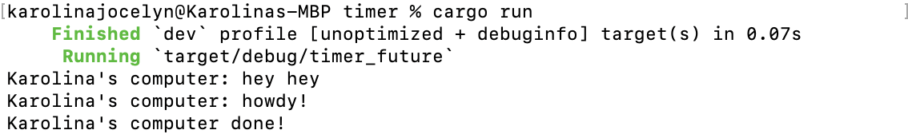
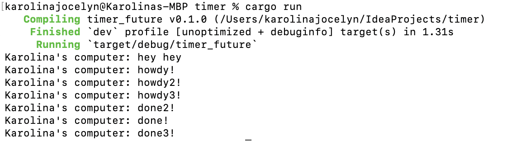

# timer-module10

### Experiment 1.2: Understanding how it works.

Pada kode, perbedaan utamanya terletak pada penambahan satu baris println! di luar task async, tepat sebelum executor dijalankan. Karena async task tidak langsung dieksekusi secara blocking, baris tersebut dieksekusi lebih dulu oleh thread utama, sehingga output "Karolina's computer: hey hey" muncul sebelum log dari dalam async task seperti "howdy!" dan "done!". Hal ini menunjukkan bahwa eksekusi utama tidak menunggu future selesai dan langsung melanjutkan ke instruksi berikutnya. Meskipun future tetap berjalan setelah dijadwalkan, ia baru benar-benar berjalan ketika dipoll oleh executor, dan bukan saat dipanggil.

### Experiment 1.3: Multiple Spawn and removing drop

Terdapat tiga buah task dengan pesan "howdy1", "howdy2", dan "howdy3". Ketiganya berjalan secara konkuren, bukan berurutan, sehingga urutan output done tidak selalu mengikuti urutan howdy. Hal ini menunjukkan bahwa executor akan segera mem-poll semua task yang tersedia dan menunggu masing-masing menyelesaikan future-nya. Baris println!("Karolina's computer: hey hey") tetap dieksekusi lebih dulu karena berada di luar blok async, menunjukkan bahwa thread utama tidak diblokir oleh task async. Setelah semua task dikirim, drop(spawner) memastikan tidak ada task baru yang akan ditambahkan, sehingga executor bisa selesai dengan bersih setelah semua future selesai diproses.